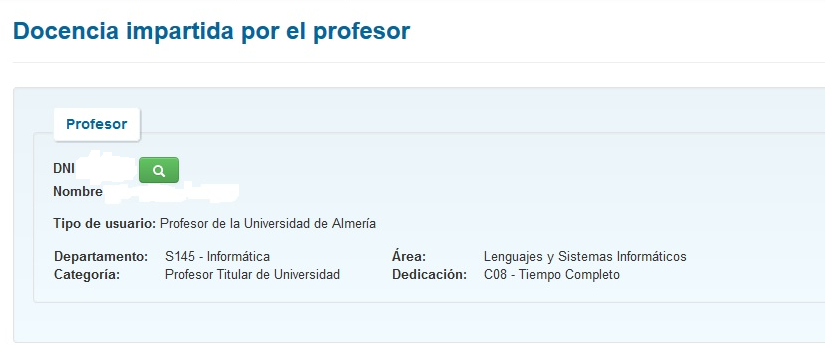
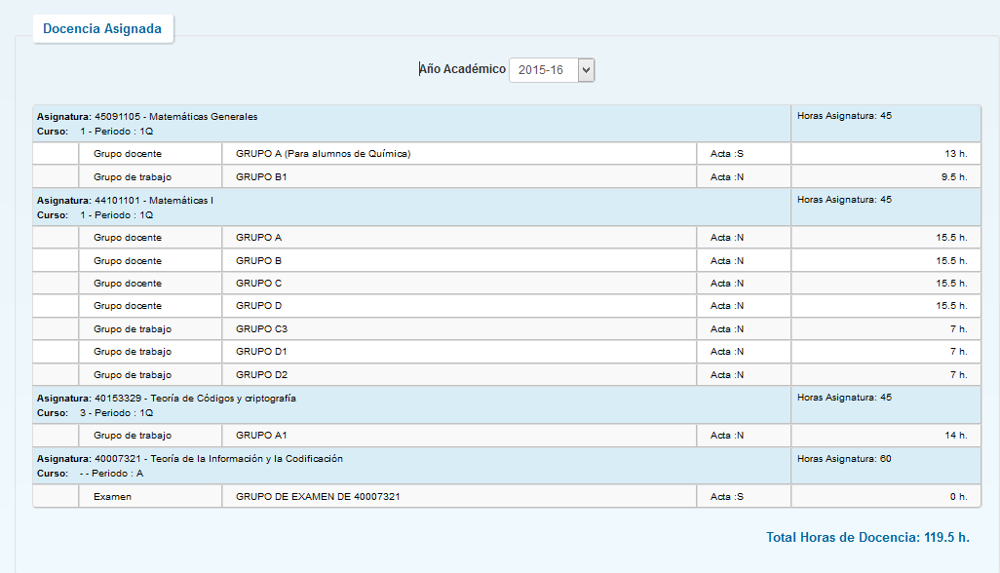
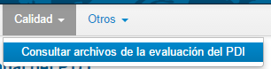

////
NO CAMBIAR!!
Codificación, idioma, tabla de contenidos, tipo de documento
////
:encoding: utf-8
:lang: es
:toc: right
:toc-title: Tabla de contenidos
:doctype: book
:figure-caption: Figura
:linkattrs:

////
Nombre y título del trabajo
////
# Manual de usuario para el profesorado
Gestión de apoyo a la docencia. STIC - Universidad de Almería

image::images/logocloudstic.png[]

// NO CAMBIAR!! (Entrar en modo no numerado de apartados)
:numbered!: 

[abstract]
== Resumen
////
COLOCA A CONTINUACION EL RESUMEN
////
Atenea es la aplicación de Gestión de apoyo al docente en tareas de gestión relacionadas con su actividad docente en la Universidad de Almería.

////
COLOCA A CONTINUACION LOS OBJETIVOS
////
.Objetivos
* Conocer las opciones principales de la aplicación
* Aprender a consultar datos de docencia y reducciones
* Aprender a obtener certificados

Versión 2.0

==  Introducción

Esta aplicación tiene como objetivo servir de apoyo al docente en sus labores de gestión relacionadas con su actividad docente en la Universidad de Almería.

Aunque a lo largo del tiempo las opciones disponibles para el docente irán aumentando, en estos momentos las actividades que podrá realizar el profesor son:

* Consulta de docencia asignada
* Consulta de reducciones docentes reconocidas
* Solicitud de certificados docentes firmados digitalmente:
** Coordinación de asignaturas
** Dirección de tesis doctorales
* Descarga del Informe de satisfacción con la labor docente

== Requisitos del Sistema.

Esta aplicación ha sido probada con éxito en los navegadores Google, Chrome y Mozilla Firefox.

== Acceso a la aplicación 

El acceso a la aplicación se realiza a través de campus virtual.

Una vez dentro seleccionamos la pestaña *_Empleado_* y *_Mi Trabajo_*, a continuación en *_Gestión Docente_* tenemos la opción de menú *_Mi Docencia_*.

Al entrar en la aplicación nos aparece la siguiente pantalla:

También se podrá acceder directamente a la aplicación desde el enlace:

https://portal.ual.es/prfUal/home.seam

== Opciones de Menú

Las opciones de menú que el profesorado tiene disponible en la aplicación actualmente son:

* Consultas
** Docencia
** Reducciones
* Certificados
** Solicitar certificado
* Calidad
** Consultar archivos de la evaluación del PDI
* Otros
** Manual de usuario
** Otros Formularios y Documentos

== Consultas

=== Consulta de Docencia 

En la pantalla de consulta de docencia el profesor podrá consultar la docencia asignada en el año que indique en el filtro disponible.

A esta opción de menú se accede desde :

image:extracted-media/media/image5.png[image,width=192,height=126]

Por defecto, al entrar en la pantalla los datos que se obtendrán serán los del año académico en curso.

==== Bloque de datos del profesor:

En este bloque se obtiene los datos generales del profesor y tiene este aspecto:

==== Bloque de Datos de Docencia

En este bloque aparecen los datos consultados para el curso académico seleccionado. Por defecto aparecerán los datos del año académico en curso .

Para cada asignatura los datos que se obtienen son curso, periodo y horas de docencia .

Para cada grupo en el que imparta docencia el profesor, para el año académico seleccionado, aparecerá el nombre del grupo, si el profesor es o no el profesor principal del acta del grupo , y las horas de docencia que el profesor imparte en dicho grupo .

Al final del listado aparecerá un resumen con el número total de horas impartidas por el profesor en el año académico seleccionado.

=== Consulta de Reducciones

En la pantalla de consulta de Reducciones el profesorado permanente a tiempo completo podrá consultar las horas de docencia reducida por actividades investigadoras, cargos y tareas de gestión académica y actividades docentes complementarias realizadas el año académico anterior.

La opción de menú donde se encuentra esta opción es la siguiente:

image:extracted-media/media/image5.png[image,width=174,height=116]

Por defecto, al entrar en la pantalla los datos que se obtendrán serán los del año académico en curso.

==== Bloque de datos del profesor:

En este bloque se obtiene los datos generales de profesor y tiene este aspecto:

==== Bloque de Datos de la Consulta

Aparecerán todos los tipos, subtipos y horas correspondientes a las Reducciones de docencia reconocidas al profesor el año académico consultado.

Al final del listado aparecerá un resumen con el número total de horas reconocidas para el profesor en el año académico seleccionado.

== Certificados

Cuando se selecciona la opción de menú “Solicitar certificados” accedemos a la siguiente página de la aplicación:

Donde en la parte inferior irán paulatinamente apareciendo los posibles certificados docentes disponibles.

En la actualidad:

* CDA – Coordinación de Asignaturas
* DTE – Dirección de Tesis

Y en breve:

* PTT – Participación en Tribunales de Tesis

Para solicitarlos se pincha sobre el nombre del certificado deseado y nos lleva a una pantalla de opciones.

=== Certificado CDA – Coordinación de Asignaturas

Si pinchamos sobre el primero disponible nos aparecerá la siguiente pantalla:

Donde podemos seleccionar cualquiera de las tres opciones disponibles:

* *+++Previsualizar certificado+++*: nos muestra en pantalla el certificado en formato pdf y es descargable si solo lo queremos a efectos informativos.
* *+++Solicitar certificado firmado+++*: el fichero generado en pdf es como el anterior pero va firmado digitalmente por la autoridad competente de tal manera que es válido a todos los efectos como los emitidos hasta ahora por el Servicio de Ordenación Docente.
* *+++Cerrar+++*: vuelve a la pantalla anterior

Si hemos elegido alguna de las dos primeras y queremos volver a la pantalla previa, se debe pinchar en página anterior en el navegador.

=== Certificado DTE – Dirección de Tesis

Como en el caso anterior, sale también una pantalla emergente que nos permite elegir además de las opciones anteriores, el año académico desde el que queremos obtener los datos, siendo el más antiguo del que se disponen datos el curso 1993-94.

El resto de opciones funcionan igual que en el caso anterior.

== Calidad

Esta opción de menú permite al profesorado la descarga directa de su "Informe de satisfacción con la labor docente" que elabora el Servicio de Planificación, Evaluación y Calidad con el aprobado de la Dirección General de Calidad de la Ual.

Al seleccionar la opción:

Nos aparece la siguiente pantalla:

Donde por defecto aparecerán todos los ficheros que haya disponibles para el profesor identificado, y también se permite la búsqueda por cursos académicos; pinchando sobre el nombre del archivo que va identificado con el N.I.F. del docente se produce la descarga

Que podrá visualizarse pinchando sobre el enlace que se observa en la esquina inferior izquierda:

== Otros

=== Manual de usuario

En esta opción se encuentra el enlace a este documento.

=== Otros Formularios y Documentos

____
En esta opción se encuentra un enlace a la siguiente página de la web institucional:
____

http://www.ual.es[UAL] http://cms.ual.es/UAL/universidad/index.htm[Universidad] http://cms.ual.es/UAL/universidad/serviciosgenerales/index.htm[Servicios Generales] http://cms.ual.es/UAL/universidad/serviciosgenerales/asuntosgenerales/index.htm[Serv. O. Docente, Planes y Formación] http://cms.ual.es/UAL/universidad/serviciosgenerales/asuntosgenerales/servicios/index.htm[Qué ofrecemos]
